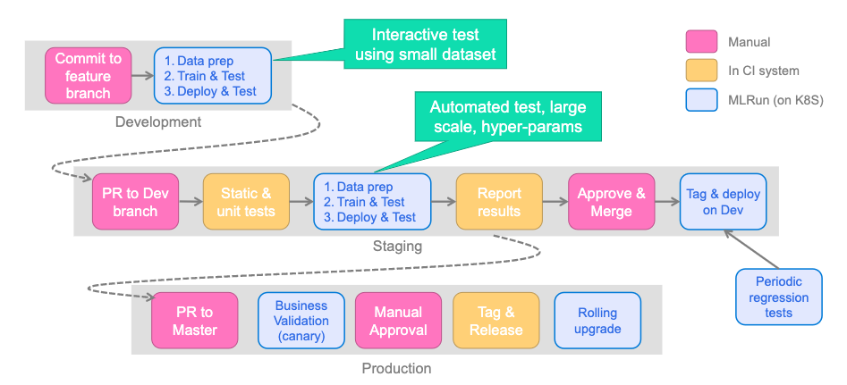
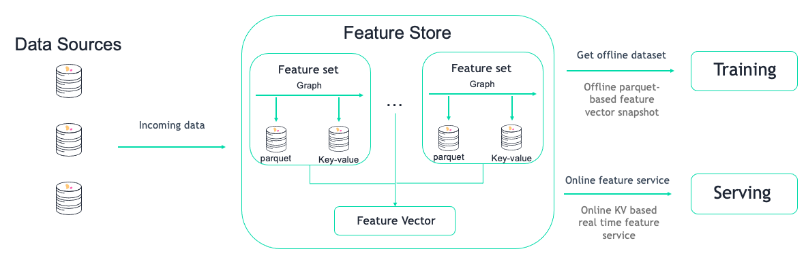
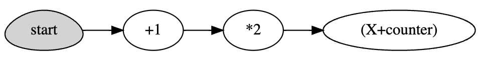
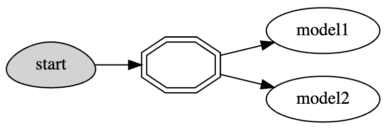
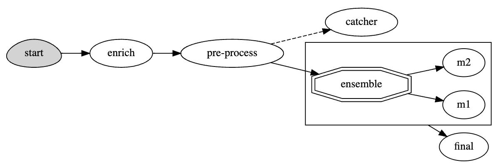

# MLRun Cheat Sheet
{:.no_toc}

## Table of Contents
{:.no_toc}

* TOC
{:toc}

## MLRun Setup
Docs: [Set up your client environment](https://docs.mlrun.org/en/latest/install/remote.html), [Installation and setup guide](https://docs.mlrun.org/en/latest/install.html)

### MLRun Server/Client Overview
{:.no_toc}

MLRun has two main components, the service and the client (SDK)
- MLRun service runs over Kubernetes (can also be deployed using local Docker for demo and test purposes) - see [installation documentation](https://docs.mlrun.org/en/latest/install.html) for more information
- MLRun client SDK is installed in your development environment via `pip` and interacts with the service using REST API calls

### Remote Connection (Laptop, CI/CD, etc.)
{:.no_toc}

Create a `mlrun.env` file for environment variables
```
# MLRun DB
MLRUN_DBPATH=<URL endpoint of the MLRun APIs service endpoint; e.g., "https://mlrun-api.default-tenant.app.mycluster.iguazio.com">

# Iguazio filesystem
V3IO_USERNAME=<username of a platform user with access to the MLRun service>
V3IO_ACCESS_KEY=<platform access key>
```

Connect via MLRun Python SDK
```python
# Import MLRun
import mlrun

# Set environment variables - secrets, remote API endpoint, etc.
mlrun.set_env_from_file("mlrun.env")
```

## MLRun Projects
Docs: [Projects and automation](https://docs.mlrun.org/en/latest/projects/project.html)

### General Workflow
Docs: [Create, save, and use projects](https://docs.mlrun.org/en/latest/projects/create-project.html)
```python
# Create or load project
project = mlrun.get_or_create_project(name="my-project", context="./")

# Add function to project
project.set_function(name='train_model', func='train_model.py', kind='job', image='mlrun/mlrun')

# Add workflow (pipeline) to project
project.set_workflow(name='training_pipeline', workflow_path='straining_pipeline.py')

# Save project and generate project.yaml file
project.save()

# Run pipeline via project
project.run(name="training_pipeline", arguments={...})
```

### Git Integration
Docs: [Create and use functions](https://docs.mlrun.org/en/latest/runtimes/create-and-use-functions.html#multiple-source-files)

An MLRun project can be backed by a Git repo. Functions will consume the repo and pull the code either once when Docker image is built (production workflow) or at runtime (development workflow).

#### Pull repo code once (bake into Docker image)
{:.no_toc}

```python
project.set_source(source="git://github.com/mlrun/project-archive.git")

fn = project.set_function(
    name="myjob", handler="job_func.job_handler",
    image="mlrun/mlrun", kind="job", with_repo=True,
)

project.build_function(fn)
```

#### Pull repo code at runtime
{:.no_toc}

```python
project.set_source(source="git://github.com/mlrun/project-archive.git", pull_at_runtime=True)

fn = project.set_function(
    name="nuclio", handler="nuclio_func:nuclio_handler",
    image="mlrun/mlrun", kind="nuclio", with_repo=True,
)
```

### CI/CD Integration

#### Overview
{:.no_toc}

Docs: [CI/CD integration](https://docs.mlrun.org/en/latest/projects/ci-integration.html)

Best practice for working with CI/CD is using [MLRun Projects](https://docs.mlrun.org/en/latest/projects/project.html) with a combination of the following:
- **Git:** Single source of truth for source code and deployments via infrastructure as code. Allows for collaboration between multiple developers. An MLRun project can (and should be) be tied to a Git repo. One project maps to one Git repo.
- **CI/CD:** Main tool for orchestrating production deployments. The CI/CD system should be responsible for deploying latest code changes from Git onto the remote cluster via MLRun Python SDK or CLI. 
- **Iguazio/MLRun:** Kubernetes based compute environment for running data analytics, model training, or model deployment tasks.  Additionally, the cluster is where all experiment tracking, job information, logs, and more is located.

See [MLRun Projects](https://docs.mlrun.org/en/latest/projects/project.html) for more information on Git and CI/CD integration. In practice, this may look something like the following:


#### Example (GitHub Actions)
{:.no_toc}

Full Example: [MLRun project-demo](https://github.com/mlrun/project-demo)

```yaml
name: mlrun-project-workflow
on: [issue_comment]

jobs:
  submit-project:
    if: github.event.issue.pull_request != null && startsWith(github.event.comment.body, '/run')
    runs-on: ubuntu-latest

    steps:
    - uses: actions/checkout@v3
    - name: Set up Python 3.7
      uses: actions/setup-python@v4
      with:
        python-version: '3.7'
        architecture: 'x64'
    
    - name: Install mlrun
      run: python -m pip install pip install mlrun
    - name: Submit project
      run: python -m mlrun project ./ --watch --run main ${CMD:5}
      env:
        V3IO_USERNAME: ${{ secrets.V3IO_USERNAME }}
        V3IO_API: ${{ secrets.V3IO_API }}
        V3IO_ACCESS_KEY: ${{ secrets.V3IO_ACCESS_KEY }}
        MLRUN_DBPATH: ${{ secrets.MLRUN_DBPATH }}
        GITHUB_TOKEN: ${{ secrets.GITHUB_TOKEN }} 
        SLACK_WEBHOOK: ${{ secrets.SLACK_WEBHOOK }}
        CMD: ${{ github.event.comment.body}}
```

### Secrets
Docs: [Working with secrets](https://docs.mlrun.org/en/latest/secrets.html)

```python
# Add secrets to project
project.set_secrets(secrets={'AWS_KEY': '111222333'}, provider="kubernetes")

# Run job with all secrets (automatically injects all project secrets for non-local runtimes)
project.run_function(fn)

# Retrieve secret within job
context.get_secret("AWS_KEY")
```

## MLRun Functions

### Essential Runtimes
Docs: [Kinds of functions (runtimes)](https://docs.mlrun.org/en/latest/concepts/functions-overview.html)

#### Job
{:.no_toc}

```python
# Job - run once to completion
job = project.set_function(name="my-job", func="my_job.py", kind="job", image="mlrun/mlrun", handler="handler")
project.run_function(job)
```

#### Nuclio
{:.no_toc}

```python
# Nuclio - generic real-time function to do something when triggered
nuclio = project.set_function(name="my-nuclio", func="my_nuclio.py", kind="nuclio", image="mlrun/mlrun", handler="handler")
project.deploy_function(nuclio)
```

#### Serving
{:.no_toc}

```python
# Serving - specialized Nuclio function specifically for model serving
serving = project.set_function(name="my-serving", func="my_serving.py", kind="serving", image="mlrun/mlrun", handler="handler")
serving.add_model(key="iris", model_path="https://s3.wasabisys.com/iguazio/models/iris/model.pkl", model_class="ClassifierModel")
project.deploy_function(serving)
```

### Distributed Runtimes
Docs: [Kinds of functions (runtimes)](https://docs.mlrun.org/en/latest/concepts/functions-overview.html)

#### MPIJob (Horovod)
{:.no_toc}

```python
mpijob = mlrun.code_to_function(name="my-mpijob", filename="my_mpijob.py", kind="mpijob", image="mlrun/mlrun", handler="handler")
mpijob.spec.replicas = 3
mpijob.run()
```

#### Dask
{:.no_toc}

```python
dask = mlrun.new_function(name="my-dask", kind="dask", image="mlrun/ml-models")
dask.spec.remote = True
dask.spec.replicas = 5
dask.spec.service_type = 'NodePort'
dask.with_limits(mem="6G")
dask.spec.nthreads = 5
dask.apply(mlrun.mount_v3io())
dask.client
```

#### Spark Operator
{:.no_toc}

```python
import os
read_csv_filepath = os.path.join(os.path.abspath('.'), 'spark_read_csv.py')

spark = mlrun.new_function(kind='spark', command=read_csv_filepath, name='sparkreadcsv') 
spark.with_driver_limits(cpu="1300m")
spark.with_driver_requests(cpu=1, mem="512m") 
spark.with_executor_limits(cpu="1400m")
spark.with_executor_requests(cpu=1, mem="512m")
spark.with_igz_spark() 
spark.spec.replicas = 2 

spark.deploy() # build image
spark.run(artifact_path='/User') # run spark job
```

### Resource Management
Docs: [Managing job resources](https://docs.mlrun.org/en/latest/runtimes/configuring-job-resources.html)

#### Requests/Limits (MEM/CPU/GPU)
{:.no_toc}

```python
# Requests - lower bound
fn.with_requests(mem="1G", cpu=1)

# Limits - upper bound
fn.with_limits(mem="2G", cpu=2, gpus=1)
```

#### Scaling + Auto-Scaling
{:.no_toc}

```python
# Nuclio/serving scaling
fn.spec.replicas = 2
fn.spec.min_replicas = 1
fn.spec.min_replicas = 4
```

#### Mount Persistent Storage
{:.no_toc}

```python
# Mount Iguazio V3IO
fn.apply(mlrun.mount_v3io())

# Mount PVC
fn.apply(mlrun.platforms.mount_pvc(pvc_name="data-claim", volume_name="data", volume_mount_path="/data"))
```

#### Pod Priority
{:.no_toc}

```python
fn.with_priority_class(name="igz-workload-medium")
```

#### Node Selection
{:.no_toc}

```python
fn.with_node_selection(node_selector={"app.iguazio.com/lifecycle" : "non-preemptible"})
```

### Serving/Nuclio Triggers
{:.no_toc}

Docs: [Nuclio Triggers](https://github.com/nuclio/nuclio-jupyter/blob/development/nuclio/triggers.py)
```python
import nuclio
serve = mlrun.import_function('hub://v2_model_server')

# HTTP trigger
serve.with_http(workers=8, port=31010, worker_timeout=10)

# V3IO stream trigger
serve.add_v3io_stream_trigger(stream_path='v3io:///projects/myproj/stream1', name='stream', group='serving', seek_to='earliest', shards=1)

# Kafka stream trigger
serve.add_trigger(
    name="kafka",
    spec=nuclio.KafkaTrigger(brokers=["192.168.1.123:39092"], topics=["TOPIC"], partitions=4, consumer_group="serving", initial_offset="earliest")
)

# Cron trigger
serve.add_trigger("cron_interval", spec=nuclio.CronTrigger(interval="10s"))
serve.add_trigger("cron_schedule", spec=nuclio.CronTrigger(schedule="0 9 * * *"))
```

### Building Docker Images
Docs: [Build function image](https://docs.mlrun.org/en/latest/runtimes/image-build.html), [Images and their usage in MLRun](https://docs.mlrun.org/en/latest/runtimes/images.html#images-usage)

#### Manually Build Image
{:.no_toc}

```python
project.set_function(
   "train_code.py", name="trainer", kind="job",
   image="mlrun/mlrun", handler="train_func", requirements=["pandas==1.3.5"]
)

project.build_function(
    "trainer",
    # Specify base image
    base_image="myrepo/base_image:latest",
    # Run arbitrary commands
    commands= [
        "pip install git+https://github.com/myusername/myrepo.git@mybranch",
        "mkdir -p /some/path && chmod 0777 /some/path",    
    ]
)
```

#### Automatically Build Image
{:.no_toc}

```python
project.set_function(
   "train_code.py", name="trainer", kind="job",
   image="mlrun/mlrun", handler="train_func", requirements=["pandas==1.3.5"]
)

# auto_build will trigger building the image before running, 
# due to the additional requirements.
project.run_function("trainer", auto_build=True)
```

## Logging
Docs: [MLRun execution context](https://docs.mlrun.org/en/latest/concepts/mlrun-execution-context.html)

```python
context.logger.debug(message="Debugging info")
context.logger.info(message="Something happened")
context.logger.warning(message="Something might go wrong")
context.logger.error(message="Something went wrong")
```

## Experiment Tracking
Docs: [MLRun execution context](https://docs.mlrun.org/en/latest/concepts/mlrun-execution-context.html), [Automated experiment tracking](https://docs.mlrun.org/en/latest/concepts/auto-logging-mlops.html), [Decorators and auto-logging](https://docs.mlrun.org/en/latest/concepts/decorators-and-auto-logging.html)

### Manual Logging
{:.no_toc}

```python
context.log_result(key="accuracy", value=0.934)
context.log_model(key="model", model_file="model.pkl")
context.log_dataset(key="model", df=df, format="csv", index=False)
```

### Automatic Logging
{:.no_toc}

```python
# Auto logging for ML frameworks
from mlrun.frameworks.sklearn import apply_mlrun

apply_mlrun(model=model, model_name="my_model", x_test=X_test, y_test=y_test)
model.fit(X_train, y_train)

# MLRun decorator for input/output parsing
@mlrun.handler(labels={'framework':'scikit-learn'},
               outputs=['prediction:dataset'],
               inputs={"train_data": pd.DataFrame,
                       "predict_input": pd.DataFrame})
def train_and_predict(train_data,
                      predict_input,
                      label_column='label'):

    x = train_data.drop(label_column, axis=1)
    y = train_data[label_column]

    clf = SVC()
    clf.fit(x, y)

    return list(clf.predict(predict_input))
```

## Model Inferencing and Serving
Docs: [Deploy models and applications](https://docs.mlrun.org/en/latest/deployment/index.html)

### Real-Time Serving
{:.no_toc}

Docs: [Using built-in model serving classes](https://docs.mlrun.org/en/latest/serving/built-in-model-serving.html), [Build your own model serving class](https://docs.mlrun.org/en/latest/serving/custom-model-serving-class.html), [Model serving API](https://docs.mlrun.org/en/latest/serving/model-api.html)

```python
serve = mlrun.import_function('hub://v2_model_server')
serve.add_model(key="iris", model_path="https://s3.wasabisys.com/iguazio/models/iris/model.pkl")

# Deploy to local mock server (Development testing)
mock_server = serve.to_mock_server()

# Deploy to serverless function (Production K8s deployment)
addr = serve.deploy()
```

### Batch Inferencing
{:.no_toc}

Docs: [Batch inference](https://docs.mlrun.org/en/latest/deployment/batch_inference.html)

```python
batch_inference = mlrun.import_function("hub://batch_inference")
batch_run = project.run_function(
    batch_inference,
    inputs={"dataset": prediction_set_path},
    params={"model": model_artifact.uri},
)
```

## Model Monitoring + Drift Detection
Docs: [Model monitoring overview](https://docs.mlrun.org/en/latest/monitoring/model-monitoring-deployment.html), [Batch inference](https://docs.mlrun.org/en/latest/deployment/batch_inference.html) 

### Real Time Drift Detection
{:.no_toc}

```python
# Log model with training set
context.log_model("model", model_file="model.pkl", training_set=X_train)

# Enable tracking for model server
serving_fn = import_function('hub://v2_model_server', project=project_name).apply(auto_mount())
serving_fn.add_model("model", model_path="store://models/project-name/model:latest") # Model path comes from experiment tracking DB
serving_fn.set_tracking()

# Deploy model server
serving_fn.deploy()
```

### Batch Drift Detection
{:.no_toc}

```python
batch_inference = mlrun.import_function("hub://batch_inference")
batch_run = project.run_function(
    batch_inference,
    inputs={
        "dataset": prediction_set_path,
        "sample_set": training_set_path
    },
    params={
        "model": model_artifact.uri,
        "label_columns": "label",
        "perform_drift_analysis" : True
    }
)
```

## Sources and Targets

Abstract underlying storage to easily retrieve and store data from various sources

Docs: [Ingest data using the feature store](https://docs.mlrun.org/en/latest/data-prep/ingest-data-fs.html)

### Sources
{:.no_toc}

Docs: [Sources](https://docs.mlrun.org/en/latest/serving/available-steps.html#sources)

```python
from mlrun.datastore.sources import CSVSource, ParquetSource, BigQuerySource, KafkaSource

# CSV
csv_source = CSVSource(name="read", path="/User/getting_started/examples/demo.csv")
csv_df = csv_source.to_dataframe()

# Parquet
from pyspark.sql import SparkSession

session = SparkSession.builder.master("local").getOrCreate()
parquet_source = ParquetSource(name="read", path="v3io://users/admin/getting_started/examples/userdata1.parquet")
spark_df = parquet_source.to_spark_df(session=session)

# BigQuery
bq_source = BigQuerySource(name="read", table="the-psf.pypi.downloads20210328", gcp_project="my_project")
bq_df = bq_source.to_dataframe()

# Kafka
kafka_source = KafkaSource(
    name="read",
    brokers='localhost:9092',
    topics='topic',
    group='serving',
    initial_offset='earliest'
)
kafka_source.add_nuclio_trigger(function=fn)

# Snowflake
snowflake_source = SnowflakeSource(
    name="read",
    query="select * from customer limit 100000",
    url="<url>",
    user="<user>",
    password="<password>",
    database="SNOWFLAKE_SAMPLE_DATA",
    schema="TPCH_SF1",
    warehouse="compute_wh",
)
snowflake_df = snowflake_source.to_dataframe()
```

### Targets
{:.no_toc}

Docs: [Targets](https://docs.mlrun.org/en/latest/serving/available-steps.html#targets)

```python
from mlrun.datastore.targets import CSVTarget, ParquetTarget

# CSV
csv_target = CSVTarget(name="write", path="/User/test.csv")
csv_target.write_dataframe(df=csv_df, key_column="id")

# Parquet
pq_target = ParquetTarget(
    name="write",
    path="/User/test.parquet",
    partitioned=True,
    partition_cols=["country"]
)
pq_target.write_dataframe(df=pq_df, key_column="id")

# Redis (see docs for writing online features)
redis_target = RedisNoSqlTarget(name="write", path="redis://1.2.3.4:6379")
redis_target.write_dataframe(df=redis_df)

# Kafka (see docs for writing online features)
kafka_target = KafkaSource(
    name="write",
    bootstrap_servers='localhost:9092',
    topic='topic',
)
redis_target.write_dataframe(df=kafka_df)
```

## Feature Store
Docs: [Feature Store](https://docs.mlrun.org/en/latest/feature-store/feature-store.html), [Feature sets](https://docs.mlrun.org/en/latest/feature-store/feature-sets.html), [Feature set transformations](https://docs.mlrun.org/en/latest/feature-store/transformations.html), [Creating and using feature vectors](https://docs.mlrun.org/en/latest/feature-store/feature-vectors.html)

### Definitions
{:.no_toc}

Docs: [Feature store overview](https://docs.mlrun.org/en/latest/feature-store/feature-store-overview.html)

- Feature Set: A group of features that can be ingested together and stored in logical group (usually one-to-one with a dataset, stream, table, etc.)
- Feature Vector: A group of features from different Feature Sets



### Engines
{:.no_toc}

Docs: [Ingest data using the feature store](https://docs.mlrun.org/en/latest/data-prep/ingest-data-fs.html), [Ingest features with Spark](https://docs.mlrun.org/en/latest/feature-store/using-spark-engine.html)

- `storey` engine (default) is designed for real-time data (e.g. individual records) that will be transformed using Python functions and classes
- `pandas` engine is designed for batch data that can fit into memory that will be transformed using Pandas dataframes
- `spark` engine is designed for batch data that cannot fit into memory that will be transformed using Spark dataframes

### Feature Sets
{:.no_toc}

Docs: [Feature sets](https://docs.mlrun.org/en/latest/feature-store/feature-sets.html)

#### Basic Ingestion
{:.no_toc}

```python
import mlrun.feature_store as fstore
from mlrun.datastore.sources import ParquetSource

categorical_fset = fstore.FeatureSet(
    name="heart-disease-categorical",
    entities=[fstore.Entity("patient_id")],
    description="Categorical columns for heart disease dataset"
)

fstore.ingest(
    featureset=categorical_fset,
    source=ParquetSource(path="./data/heart_disease_categorical.parquet")
)
```

#### Feature Set per Engine
{:.no_toc}

```python
from mlrun.datastore.sources import DataFrameSource

# Storey engine
storey_set = fstore.FeatureSet(
    name="heart-disease-storey",
    entities=[fstore.Entity("patient_id")],
    description="Heart disease data via storey engine",
    engine="storey"
)
fstore.ingest(featureset=storey_set, source=DataFrameSource(df=data))

# Pandas engine
pandas_set = fstore.FeatureSet(
    name="heart-disease-pandas",
    entities=[fstore.Entity("patient_id")],
    description="Heart disease data via pandas engine",
    engine="pandas"
)
fstore.ingest(featureset=pandas_set, source=DataFrameSource(df=data))

# Spark engine
from pyspark.sql import SparkSession
spark = SparkSession.builder.appName("Spark function").getOrCreate()

spark_set = fstore.FeatureSet(
    name="heart-disease-spark",
    entities=[fstore.Entity("patient_id")],
    description="Heart disease data via spark engine",
    engine="spark"
)
fstore.ingest(featureset=spark_set, source=CSVSource(path=v3io_data_path), spark_context=spark)
```

### Feature Vectors
{:.no_toc}

Docs: [Feature vectors](https://docs.mlrun.org/en/latest/feature-store/feature-vectors.html)

#### Basic Retrieval
{:.no_toc}

```python
import mlrun.feature_store as fstore
from mlrun.datastore.targets import ParquetTarget

fvec = fstore.FeatureVector(
    name="heart-disease-vector",
    features=["heart-disease-categorical.*", "heart-disease-continuous.*"],
    description="Heart disease dataset",
)
fvec.save()

# Offline features for training
df = fstore.get_offline_features("iguazio-academy/heart-disease-vector").to_dataframe()

# Materialize offline features to parquet
fstore.get_offline_features("iguazio-academy/heart-disease-vector", target=ParquetTarget())

# Online features for serving
feature_service = fstore.get_online_feature_service(feature_vector="iguazio-academy/heart-disease-vector")
feature_service.get(
    [
        {"patient_id" : "e443544b-8d9e-4f6c-9623-e24b6139aae0"},
        {"patient_id" : "8227d3df-16ab-4452-8ea5-99472362d982"}
    ]
)
```

## Real-Time Pipelines
Docs: [Real-time serving pipelines](https://docs.mlrun.org/en/latest/serving/serving-graph.html), [Real-time pipeline use cases](https://docs.mlrun.org/en/latest/serving/use-cases.html#), [Graph concepts and state machine](https://docs.mlrun.org/en/latest/serving/realtime-pipelines.html), [Model serving graph](https://docs.mlrun.org/en/latest/serving/model-serving-get-started.html), [Writing custom steps](https://docs.mlrun.org/en/latest/serving/writing-custom-steps.html)

### Definitions
{:.no_toc}

Graph is composed of the following:
- Step: A Step runs a function or class handler or a REST API call
- Router: A special type of step is a router with routing logic and multiple child routes/models
- Queue: A queue or stream that accepts data from one or more source steps and publishes to one or more output steps

Graph has two modes (topologies):
- Router topology (default): A minimal configuration with a single router and child tasks/routes
- Flow topology: A full graph/DAG

### Simple Graph
{:.no_toc}

Docs: [Real-time serving pipelines getting started](https://docs.mlrun.org/en/latest/serving/getting-started.html#getting-started)

Define Python file(s) to orchestrate
```python
# graph.py
def inc(x):
    return x + 1

def mul(x):
    return x * 2

class WithState:
    def __init__(self, name, context, init_val=0):
        self.name = name
        self.context = context
        self.counter = init_val

    def do(self, x):
        self.counter += 1
        print(f"Echo: {self.name}, x: {x}, counter: {self.counter}")
        return x + self.counter
```

Define MLRun function and graph
```python
import mlrun
fn = project.set_function(
    name="simple-graph", func="graph.py",
    kind="serving", image="mlrun/mlrun"
)
graph = fn.set_topology("flow")

# inc, mul, and WithState are all defined in graph.py
graph.to(name="+1", handler='inc')\
     .to(name="*2", handler='mul')\
     .to(name="(X+counter)", class_name='WithState').respond()

# Local testing
server = fn.to_mock_server()
server.test(body=5)

# K8s deployment
project.deploy_function(fn)
```


### Simple Model Serving Router
{:.no_toc}

Docs: [Example of a simple model serving router](https://docs.mlrun.org/en/latest/serving/use-cases.html#example-of-a-simple-model-serving-router)

```python
# load the sklearn model serving function and add models to it  
fn = mlrun.import_function('hub://v2_model_server')
fn.add_model("model1", model_path="s3://...")
fn.add_model("model2", model_path="store://...")

# deploy the function to the cluster
project.deploy_function(fn)

# test the live model endpoint
fn.invoke('/v2/models/model1/infer', body={"inputs": [5]})
```


### Custom Model Serving Class
{:.no_toc}

Docs: [Model serving graph](https://docs.mlrun.org/en/latest/serving/model-serving-get-started.html)

```python
from cloudpickle import load
from typing import List
import numpy as np

import mlrun

class ClassifierModel(mlrun.serving.V2ModelServer):
    def load(self):
        """load and initialize the model and/or other elements"""
        model_file, extra_data = self.get_model(".pkl")
        self.model = load(open(model_file, "rb"))

    def predict(self, body: dict) -> List:
        """Generate model predictions from sample."""
        feats = np.asarray(body["inputs"])
        result: np.ndarray = self.model.predict(feats)
        return result.tolist()
```

### Advanced Data Processing and Serving Ensemble
{:.no_toc}

```python
fn = project.set_function(
    name="advanced", func="demo.py", 
    kind="serving", image="mlrun/mlrun"
)
graph = function.set_topology("flow", engine="async")

# use built-in storey class or our custom Echo class to create and link Task steps
graph.to("storey.Extend", name="enrich", _fn='({"tag": "something"})') \
     .to(class_name="Echo", name="pre-process", some_arg='abc').error_handler("catcher")

# add an Ensemble router with two child models (routes), the "*" prefix mark it is a router class
router = graph.add_step("*mlrun.serving.VotingEnsemble", name="ensemble", after="pre-process")
router.add_route("m1", class_name="ClassifierModel", model_path=path1)
router.add_route("m2", class_name="ClassifierModel", model_path=path2)

# add the final step (after the router) which handles post processing and respond to the client
graph.add_step(class_name="Echo", name="final", after="ensemble").respond()

# add error handling step, run only when/if the "pre-process" step fail (keep after="")  
graph.add_step(handler="error_catcher", name="catcher", full_event=True, after="")
```


## Hyperparameter Tuning
Docs: [Hyperparameter tuning optimization](https://docs.mlrun.org/en/latest/hyper-params.html)

The following examples will be using this function:
```python
# hp.py
def hyper_func(context, p1, p2):
    print(f"p1={p1}, p2={p2}, result={p1 * p2}")
    context.log_result("multiplier", p1 * p2)

# MLRun function in project
fn = project.set_function(
    name="hp",
    func="hp.py",
    image="mlrun/mlrun",
    kind="job",
    handler="hyper_func"
)
```
> Note the selector can be named any value that is logged - in this case `multiplier`

### Grid Search (default)
{:.no_toc}

Docs: [Grid Search](https://docs.mlrun.org/en/latest/hyper-params.html#grid-search-default)

Runs all parameter combinations
```python
hp_tuning_run = project.run_function(
    "hp", 
    hyperparams={"p1": [2,4,1], "p2": [10,20]}, 
    selector="max.multiplier"
)
```

### Random Search
{:.no_toc}

Docs: [Random Search](https://docs.mlrun.org/en/latest/hyper-params.html#random-search)

Runs random sample of parameter combinations
```python
hp_tuning_run = project.run_function(
    "hp",
    hyperparams={"p1": [2, 4, 1], "p2": [10, 20]},
    selector="max.multiplier",
    hyper_param_options=mlrun.model.HyperParamOptions(
        strategy="random", max_iterations=5
    ),
)
```

### List Search
{:.no_toc}

Docs: [List Search](https://docs.mlrun.org/en/latest/hyper-params.html#list-search)

Runs first parameter from each list followed by second from each list etc. **All lists must be of equal size**.
```python
hp_tuning_run = project.run_function(
    "hp",
    hyperparams={"p1": [2, 4, 1], "p2": [10, 20, 30]},
    selector="max.multiplier",
    hyper_param_options=mlrun.model.HyperParamOptions(strategy="list"),
)
```

### Parallel Executors
{:.no_toc}

Docs: [Parallel execution over containers](https://docs.mlrun.org/en/latest/hyper-params.html#parallel-execution-over-containers)

#### Dask
{:.no_toc}

Docs: [Running the workers using Dask](https://docs.mlrun.org/en/latest/hyper-params.html#running-the-workers-using-dask)

```python
# Create Dask cluster
dask_cluster = mlrun.new_function("dask-cluster", kind="dask", image="mlrun/ml-models")
dask_cluster.apply(mlrun.mount_v3io())  # add volume mounts
dask_cluster.spec.service_type = "NodePort"  # open interface to the dask UI dashboard
dask_cluster.spec.replicas = 2  # define two containers
uri = dask_cluster.save()
uri

# Run parallel hyperparameter trials
hp_tuning_run_dask = project.run_function(
    "hp",
    hyperparams={"p1": [2, 4, 1], "p2": [10, 20, 30]},
    selector="max.multiplier",
    hyper_param_options=mlrun.model.HyperParamOptions(
        strategy="grid",
        parallel_runs=4,
        dask_cluster_uri=uri,
        teardown_dask=True,
    ),
)
```

#### Nuclio
{:.no_toc}

Docs: [Running the workers using Nuclio](https://docs.mlrun.org/en/latest/hyper-params.html#running-the-workers-using-nuclio)

```python
# Create nuclio:mlrun function
fn = project.set_function(
    name='hyper-tst2',
    func="hp.py",
    kind='nuclio:mlrun',
    image='mlrun/mlrun'
)
# replicas * workers need to match or exceed parallel_runs
fn.spec.replicas = 2
fn.with_http(workers=2)
fn.deploy()

# Run the parallel tasks over the function
hp_tuning_run_dask = project.run_function(
    "hyper-tst2",
    hyperparams={"p1": [2, 4, 1], "p2": [10, 20, 30]},
    selector="max.multiplier",
    hyper_param_options=mlrun.model.HyperParamOptions(
        strategy="grid",
        parallel_runs=4,
        max_errors=3
    ),
    handler="hyper_func"
)
```